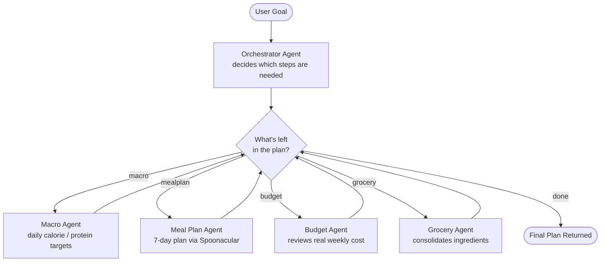

# Prep-Agent

**An AI multi-agent orchestrator for personalized meal prep.**

Describe your goal in plain English — bulking, cutting, a tight weekly budget, or just "eat better" — and an **Orchestrator Agent** decides, on the fly, exactly which specialized sub-agents are needed to build your plan. No fixed pipeline: a request that mentions a budget triggers a different set of agents than one that doesn't.

## How it works

Most "AI meal planner" apps run the same fixed sequence of steps for every request. Prep-Agent doesn't — it's built around a **dynamic orchestrator pattern**: one agent reads your goal, decides which steps actually apply, and the graph routes itself accordingly at runtime.



Each box after the Orchestrator is only visited if it's actually relevant to your specific goal — the router re-checks "what's left?" after every step, rather than following a hardcoded order.

## Features

- **Dynamic agent orchestration** — built with [LangGraph](https://github.com/langchain-ai/langgraph) conditional routing, not a fixed chain
- **Real 7-day meal plans** — sourced from the [Spoonacular](https://spoonacular.com/food-api) API, with real prices, macros, and ingredient lists per recipe
- **Budget-aware** — the Budget Agent reviews the plan's *actual* weekly cost against any budget you mention, and flags incomplete or missing data instead of guessing
- **Consolidated grocery list** — deduplicated across the full week
- **Real recipe sourcing** — every recipe links back to its original source, no fabricated attribution
- **Dark mode + luxury UI** — Next.js, Tailwind, custom theming with persisted preference

## Tech Stack

| Layer | Technology |
|---|---|
| Frontend | Next.js (App Router), React, Tailwind CSS, TypeScript |
| Backend | Python, FastAPI |
| Agent Orchestration | LangGraph, Anthropic Claude API |
| Recipe & Nutrition Data | Spoonacular API |

## Getting Started

### Prerequisites

- Python 3.9+
- Node.js 18+
- API keys: [Anthropic](https://console.anthropic.com) and [Spoonacular](https://spoonacular.com/food-api)

### Backend

```bash
cd backend
python -m venv venv
source venv/bin/activate
pip install -r requirements.txt
cp .env.example .env   # then add your real API keys
uvicorn main:app --reload --port 8000
```

### Frontend

```bash
cd frontend
npm install
npm run dev
```

Visit `http://localhost:3001` (or whichever port Next.js reports) and describe a goal — e.g. *"I'm bulking, need 180g protein a day, budget $60 a week."*

## Project Structure

```
backend/
  agents/
    orchestrator.py   # decides which steps are needed
    macro.py           # daily calorie/macro targets
    mealplan.py         # 7-day meal plan via Spoonacular
    budget.py           # reviews real weekly cost
    grocery.py           # consolidates ingredients
  state.py             # shared state schema (Pydantic)
  graph.py             # LangGraph wiring + conditional routing
  main.py              # FastAPI app + /api/plan endpoint

frontend/
  app/
    page.tsx           # main UI
    layout.tsx           # fonts, metadata
    globals.css          # theme variables, dark mode
```

## Screenshots

<!-- Add screenshots here — e.g. the form, a generated plan, dark mode -->

## Roadmap

- [ ] Real-time progress streaming as each agent runs
- [ ] Shareable plan links (persistent storage)
- [ ] Photo-based food scanning (Claude vision)
- [ ] Automated tests for agents and routing logic
- [ ] Live deployment
