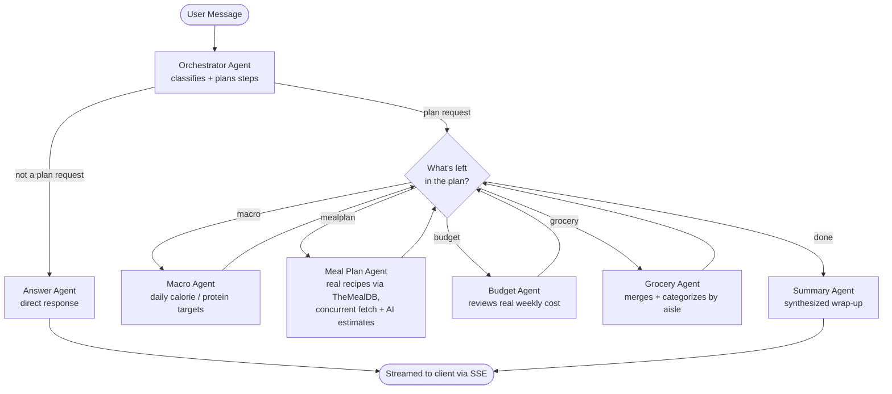

# Prep-Agent

**A multi-agent meal-prep orchestrator that decides its own execution plan at runtime.**

Describe a goal in plain English — bulking, cutting, a tight weekly budget, or just "eat better" — and an **Orchestrator Agent** decides, per request, exactly which specialized sub-agents need to run and in what order. A budget-conscious request triggers a different pipeline than a plain macro question; a follow-up like *"make it cheaper"* is understood in context, without repeating the original goal.

## Why this project

Most "AI wrapper" projects hardcode a single prompt-in, response-out chain. Prep-Agent is built the way a production agentic system actually has to be:

- **The pipeline is a decision, not a constant.** A [LangGraph](https://github.com/langchain-ai/langgraph) state machine re-evaluates "what's left to do?" after every node, so a general question skips the entire meal-planning pipeline and a budget-free request skips the budget agent — no wasted LLM calls.
- **Speed was treated as a real constraint, not an afterthought.** A 7-day plan needs ~21 independent recipe lookups and nutrition estimates; these run concurrently (bounded thread pools, tuned separately for free-HTTP calls vs. rate-limited LLM calls) instead of sequentially, cutting generation time substantially without blowing through Groq's free-tier token cap.
- **Failure modes are handled explicitly, not hoped away.** Every LLM call has typed retry logic for the two real failure modes hit during live testing (malformed structured output, rate limiting) with different backoff strategies for each. Every user-facing error is sanitized server-side — no stack traces, file paths, or raw exception text ever reach the client.
- **Zero paid dependencies.** Every LLM call runs on Groq's and Google Gemini's free tiers; recipe data comes from TheMealDB's free public API. The entire thing runs for $0.
- **Security was audited, not assumed.** CORS is environment-driven, every request has size limits (JSON body and photo uploads), every LLM prompt has explicit injection-resistance instructions, and a full secret/PII sweep (current tree *and* git history) confirmed nothing sensitive is or has ever been committed.

## How it works



Every step streams to the frontend as it completes (Server-Sent Events), and recent conversation turns are folded back into the next message's context — so a follow-up question or edit request doesn't need the original prompt repeated.

## Features

- **Dynamic agent orchestration** — LangGraph conditional routing, not a fixed chain; general questions bypass the meal-planning pipeline entirely
- **Conversational follow-ups + chat history** — every conversation is persisted and resumable; follow-up messages carry context automatically
- **Real 7-day meal plans** — real recipes from [TheMealDB](https://www.themealdb.com/api.php), fetched and estimated concurrently, with AI-estimated macros/pricing clearly labeled as estimates (the source database has no nutrition or cost data)
- **Swap any meal** — reroll a single meal from its original category without regenerating the whole plan; grocery list and day totals recompute automatically
- **Aisle-grouped, deduplicated grocery list** — merges the same ingredient across recipes even when quantities differ, then groups by Produce / Meat & Seafood / Dairy & Eggs / Grains & Bread / Pantry / Condiments & Spices
- **Budget-aware** — the Budget Agent checks the plan's real weekly cost against any stated budget and suggests specific swaps
- **Photo-based food scanning** — snap a plate, get an estimated nutrition breakdown (Gemini vision)
- **Menu decoder** — photograph a restaurant menu, get the best-fit picks for your goal with modification tips
- **Progress tracker** — log weight and daily meals, see trends over time
- **Shareable plan links** — every generated plan gets a persistent, shareable URL
- **100% free to run** — Groq + Gemini free tiers power every LLM call; TheMealDB needs no key at all
- **Production-minded security** — environment-driven CORS, request size limits, sanitized error responses, prompt-injection-resistant system prompts, and a documented security audit (see below)

## Tech Stack

| Layer | Technology |
|---|---|
| Frontend | Next.js 16 (App Router), React 19, Tailwind CSS 4, TypeScript |
| Backend | Python, FastAPI, Server-Sent Events streaming |
| Agent Orchestration | LangGraph, Groq (`openai/gpt-oss-120b` via `langchain-groq`) |
| Vision | Google Gemini (`gemini-3.6-flash` via `langchain-google-genai`) — photo scanning and menu decoding |
| Recipe Data | TheMealDB (free, keyless) |
| Persistence | SQLite — plans, conversations, recipe cache, progress history |

## Getting Started

### Prerequisites

- Python 3.9+
- Node.js 18+
- A free [Groq API key](https://console.groq.com/keys) and a free [Google AI Studio key](https://aistudio.google.com/apikey) — no payment info required for either. TheMealDB needs no key at all.

### Backend

```bash
cd backend
python -m venv venv
source venv/bin/activate
pip install -r requirements.txt
cp .env.example .env   # then add your real API keys
uvicorn main:app --reload --port 8000
```

### Frontend

```bash
cd frontend
npm install
npm run dev
```

Visit `http://localhost:3000` and describe a goal — e.g. *"I'm bulking, need 180g protein a day, budget $60 a week."*

### Tests

```bash
cd backend
python -m pytest -q   # 57 tests, fully mocked — no API keys or network calls needed
```

## Project Structure

```
backend/
  agents/
    orchestrator.py    # classifies the request and plans which steps run
    macro.py           # daily calorie/macro targets
    mealplan.py        # real recipes via TheMealDB + concurrent AI-estimated macros/price
    budget.py          # reviews real weekly cost against any stated budget
    grocery.py         # merges, dedupes, and aisle-categorizes ingredients
    summary.py         # synthesized wrap-up once the plan is complete
    answer.py          # direct responses for non-meal-plan questions
  state.py             # shared graph state schema (Pydantic)
  graph.py             # LangGraph wiring + conditional routing
  conversation.py      # folds recent chat history into follow-up context
  llm_utils.py         # shared retry/backoff logic for Groq failure modes
  scan.py              # photo -> nutrition estimate (Gemini vision)
  menu.py              # menu photo -> best-fit picks (Gemini vision)
  db.py                # SQLite: plans, conversations, recipe cache, progress
  main.py              # FastAPI app, all routes, security middleware

frontend/
  app/
    page.tsx               # tab shell, header, theme toggle
    ChatTab.tsx             # conversational chat UI with streaming progress
    ChatHistoryPanel.tsx    # resumable past-conversation list
    ExampleTab.tsx          # one-click preset goals
    ManualEntryTab.tsx      # slider-based macro/budget input
    PantryTab.tsx           # pantry inventory
    MenuDecoderTab.tsx      # restaurant menu photo decoder
    ProgressTrackerTab.tsx  # weight + daily meal logging
    PlanResults.tsx         # shared plan renderer (meal swap, grocery list, etc.)
```

## Security & Privacy

This repo has been through a top-to-bottom audit before publishing:

- No secrets, API keys, or personal paths in the current tree or anywhere in git history (verified, not assumed)
- CORS origins are environment-driven, never wildcarded
- Request bodies and photo uploads are size-capped against memory-exhaustion
- Every error response is sanitized server-side — clients never see stack traces or internal exception text
- Every LLM prompt that embeds user input includes explicit instructions to treat that input as data, not commands
- Every conversation and plan is scoped to a per-browser identifier — no cross-user data exposure

## Roadmap

- [x] Real-time progress streaming as each agent runs (SSE)
- [x] Shareable plan links (persistent storage)
- [x] Photo-based food scanning (Gemini vision)
- [x] Automated tests for agents, routing, and security behavior
- [x] Conversational follow-ups + persisted chat history
- [ ] Live deployment
